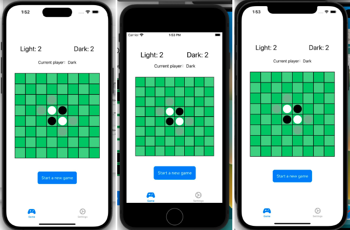
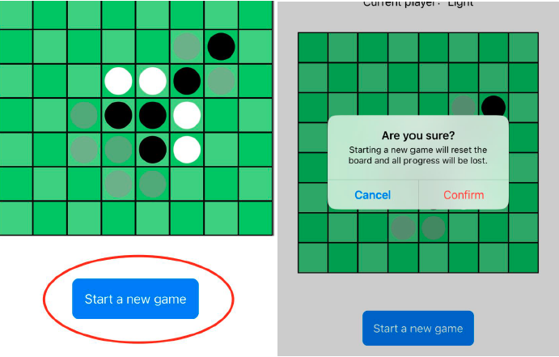
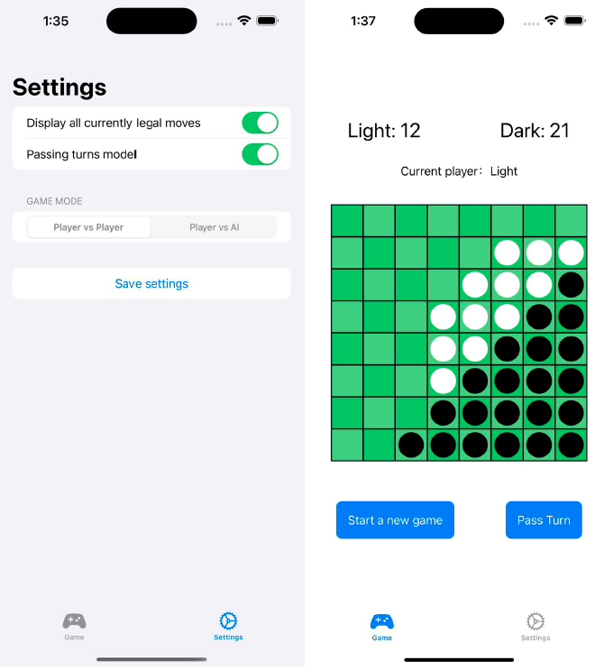

# OthelloGame: A Classic Board Game for iOS

[](LICENSE)

## Introduction
OthelloGame is an intricate rendition of the classic board game Othello, also known as Reversi, developed for iOS. This project extends beyond a basic board game app by integrating AI algorithms and leveraging SwiftUI for an interactive and intuitive user interface. It serves as a demonstration of advanced iOS application development skills, including AI implementation, reactive programming with Combine, and robust unit testing.

## Installation

### Prerequisites

- Xcode 14 or newer
- iOS 16 or newer for testing on a device

### Running the Project

To run this project, follow these steps:

```bash
git clone https://github.com/ddeerrrriicckk/OthelloGame.git
cd OthelloGame
open OthelloGame.xcodeproj
```

## Overview

OthelloGame brings the strategic depth of the board game to iOS devices with additional features like AI difficulty levels and game customization settings. It is fully functional, supporting multi-digit scoring and adaptable to various iOS devices and orientations.

## Objectives

 - Implement a complex game logic for Othello within an iOS app.
 - Integrate a challenging AI opponent using heuristic algorithms.
 - Provide a responsive and aesthetically pleasing game interface.
 - Ensure reliable and maintainable code through comprehensive unit testing.

## Functionality

 - Support for local two-player and player vs. AI game modes.
 - Adaptive and responsive UI compatible with various device sizes and orientations.
 - Real-time game state management and UI updates.
 - Strategic AI with three difficulty settings: easy, medium, and hard.

## Project Structure

The project is organized into several key directories, each encapsulating specific functionalities within the application:

### `Views`

#### `OthelloBoardView.swift`

This SwiftUI view is responsible for rendering the Othello game board. It utilizes `GeometryReader` to adapt to various screen sizes dynamically, ensuring the board occupies 90% of the view for a consistent appearance. The board is comprised of an 8x8 grid where each square can be tapped, triggering the game logic to process a move.

#### Key Features

- **Dynamic Sizing**: The board adjusts its size based on the parent view's geometry.
- **Game Interaction**: Tap gestures on squares are captured to place pieces according to Othello's rules.
- **Legal Move Visualization**: Legal moves are indicated by semi-transparent circles, providing players with strategic guidance.

#### Example Code
```swift
// This code snippet showcasing GeometryReader and tap gesture handling
GeometryReader { geometry in
    let size = min(geometry.size.width, geometry.size.height) * 0.9
    // ... additional implementation ...
}
```

```swift
// This code snippet exemplifies how the view binds user interactions directly to the ViewModel, promoting a clean separation of concerns and an event-driven architecture.
ForEach(0..<gridSize, id: \.self) { row in
    // ...
    .onTapGesture {
        viewModel.userTapped(row: row, col: col)
    }
}
```

#### `ScoreView.swift`

Presents the current score for each player, updating in real-time as the game progresses. The view listens to changes in the ViewModel's `darkScore` and `lightScore` properties, ensuring the displayed scores are always current.

#### Key Features

- **Reactive Design**: Utilizes `@ObservedObject` to react to score changes.
- **Accessibility**: Ensures scores are easily readable with a clear font and contrasting text color.

#### Example Code
```swift
// Excerpt from ScoreView showing score presentation
Text("Light: \(viewModel.lightScore)")
Text("Dark: \(viewModel.darkScore)")
```

#### `SettingsView.swift`

Offers a settings menu where players can customize their game experience, such as toggling the display of legal moves and enabling the passing turn model.

#### Key Features

- **Customization**: Gives players control over game settings, tailoring the experience to their preferences.

#### `PlayerTurnView.swift`

Indicates which player's turn it is, enhancing the user experience by clearly communicating game state. The color of the text changes based on the current player, providing an immediate visual cue.

#### Key Features

- **Player Turn Indicator**: Informs players whose turn it is to play, improving game flow and reducing confusion.

### `ViewModels`

The `ViewModels` in the Othello Game project serve as the intermediary between the game logic encapsulated within the `Models` and the user interface rendered by the `Views`. They leverage SwiftUI's ObservableObject protocol to create a reactive data flow, ensuring the UI updates in response to changes in the game state.

#### `OthelloViewModel.swift`

`OthelloViewModel` is the central nervous system of the Othello Game app. It manages the game board, scores, player turns, and AI interactions.

#### Key Features

- **Reactive State Management**: Utilizes `@Published` properties to enable SwiftUI's reactivity.

- **Game Logic Integration**: Controls the flow of the game, including move validations, score updates, and game-over conditions.

- **AI Move Calculations**: Determines AI moves based on the selected difficulty level, employing strategies from random selection to complex heuristic evaluation.


#### Example Code
```swift
// Excerpt showcasing the reactive property and move calculation
@Published private(set) var legalMoves: [Move] = []

func calculateLegalMoves() {
    legalMoves = board.getLegalMoves(for: board.currentPlayer)
}
```

#### AI Difficulty Strategies
The ViewModel defines strategies for AI moves based on the selected difficulty:

- **Easy**: Randomly selects from available legal moves.
- **Medium**: Chooses moves that maximize immediate gains based on a heuristic score.
- **Hard**: Implements a deeper strategic analysis using the alpha-beta pruning algorithm to predict and evaluate future moves.

#### Example Code
```swift
private func getMediumMove() -> Move? {
    return legalMoves.max(by: { heuristicScore(move: $0) < heuristicScore(move: $1) })
}
```
#### Game Ending Logic
Incorporates logic to determine if the game has ended, either through a full board or a situation where no further moves are possible.

#### `SettingsViewModel.swift`

Encapsulates user preferences and game settings, such as the display of legal moves and the game mode selection.


#### Key Features

- **User Preferences**: Allows players to customize their gameplay experience.
- **Game Mode Management**: Supports toggling between Player vs Player and Player vs AI modes.

#### Enums for Game Configuration
 - `GameMode`: Defines the modes of gameplay available.
 - `AIDifficulty`: Enumerates the levels of AI difficulty.
 - `ActiveAlert`: Specifies the types of alerts that can be active during the game, such as game over or illegal move notifications.


### `Models`

The models in the Othello Game project encapsulate the game's state and logic. They define the rules of Othello, manage the game board, and handle the state of each player. These models are fundamental to the game's operation and are designed to be robust and efficient.

#### `Board.swift`

Represents the game board and contains the logic to calculate legal moves, switch players, and determine the game's outcome. It maintains the state of each cell on the board and keeps track of the current player.

#### Key Features

- **Board State**: Manages an 8x8 grid representing the Othello board state.
- **Legal Move Calculation**: Determines valid moves based on the current state of the board.
- **Game Progression**: Handles switching the current player and updating the board after a move is made.

```swift
struct Board {
    // ...
    
    func getLegalMoves(for player: Player) -> [Move] {
        // Legal move calculation
    }
}
```

The `Board` struct also includes methods like `piecesToFlip` for identifying which pieces to flip after a move and `updateBoard` to apply a move to the board's state.

#### Game Logic and Rules
The `Models` directory is pivotal for the game's rules, such as identifying legal moves and calculating the resulting board state after a move. It encapsulates the logic required to play Othello within a clean and organized structure, ensuring that the game behaves as expected.

```swift
func isValidMove(player: Player, row: Int, col: Int) -> Bool {
    // Validation logic
}

func piecesToFlip(atRow row: Int, atCol col: Int, player: Player) -> [(Int, Int)] {
    // Flip calculation
}
```

## Testing

The Othello Game project includes focused unit tests using XCTest to ensure the integrity and correctness of the game logic. These tests are designed to validate crucial functionalities and game rules, demonstrating a commitment to quality and reliability.

#### Key Test Cases
Board Model Tests (`BoardTests.swift`)

- **Initial Board State**: Confirms the starting setup of the board, including piece counts and the initial player.
- **Player Switching**: Verifies the mechanism to alternate turns between players.
- **Board Updates**: Tests the board's response to players' moves, ensuring correct piece placements and flips.

ViewModel Tests (`OthelloViewModelTests.swift`)
- **User Interactions**: Validates the handling of user inputs, such as tapping to place a piece.
- **Game State Management**: Ensures accurate tracking of scores and detection of game-over scenarios.
- **AI Behavior**: Checks the AI's move selection across different difficulty settings, assessing its adaptability and strategic depth.
Example: Testing AI Move Selection

```swift
func testMediumAIMove() {
    // Asserts the AI's decision-making at medium difficulty
}
```

## Design and Implementation

The OthelloGame app is crafted with a focus on modern iOS development principles, balancing user experience with technical efficiency.

#### Architectural Design
- **Model-View-ViewModel (MVVM):** Ensures separation of concerns, improving maintainability and testability.
  - **Models:** Handle game logic and state.
  - **Views:** Developed with SwiftUI for dynamic and responsive UI.
  - **ViewModels:** Bridge between Models and Views, managing game state and user interactions.

#### User Interface Design
- **SwiftUI:** Facilitates a declarative and adaptive UI, enhancing user experience across various devices.
- **User Experience:** Intuitive design with clear indicators for scores, turns, and game state.

#### AI and Game Logic
- **Efficient Algorithms:** From simple heuristic evaluation to complex minimax with alpha-beta pruning for AI, ensuring challenging gameplay.
- **Reactive Updates:** Combine framework used for real-time UI updates in response to game state changes.

#### Performance and Testing
- **Optimized Rendering:** Focus on performance in rendering game board and interactive elements.
- **Comprehensive Testing:** Robust unit tests for core game logic and AI behavior.

#### Challenges Overcome
- **AI Development:** Balancing complexity and performance in AI implementation.
- **Responsive Design:** Ensuring a consistent user experience on all iOS devices.

This approach to design and implementation highlights a commitment to creating a high-quality, user-friendly gaming experience on iOS, showcasing advanced development techniques and thoughtful problem-solving.





